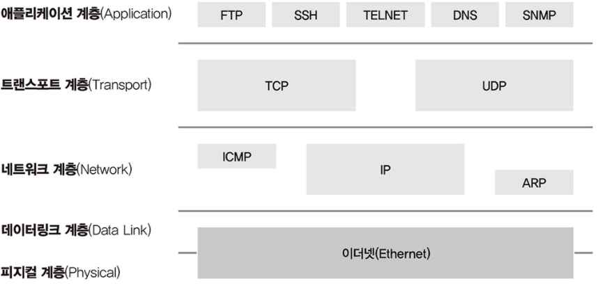

# Chapter 1  - 네트워크 시작하기

## 프로토콜(Protocol)

- **컴퓨터들 간의 원활한 통신을 위해 지키기로 약속한 규약**. 프로토콜에는 신호 처리법, 오류처리, 암호, 인증, 주소 등을 포함한다.
- 과거에는 여러가지 프로토콜이 있었으나 근래에는 **이더넷-TCP/IP** 기반들로 변경되고 있다.
    - **물리적** : 데이터 전송 매체, 신호 규약, 회선 규격 등. **이더넷**이 널리 쓰인다.
    - **논리적** : 장치들끼리 통신하기 위한 프로토콜 규격. **TCP/IP**가 널리 쓰인다.

        TCP : Transmission Control Protocol / IP : Internet Protocol

- 일반적으로 TCP/IP는 다른 계층에서 동작하기 때문에 프로토콜이라고 부르지 않고 프로토콜 스택이라고 부른다.

## OSI 7계층

OSI : Open Systems Interconnection

- 과거에는 통신용 규약이 표준화 되어있지 않아서, 각 벤더에서 별도로 개발했기 때문에 호환되지 않은 시스템이나 애플리케이션이 많아 통신이 불가했다. 이를 하나의 규약으로 통합하려는 일환으로 OSI 7계층이 되었다

---

### 하위 계층

- 신호와 데이터를 올바른 위치로 보내고 실제 신호를 잘만들어 보내는데에 집중

- **1계층 - 피지컬(Physical)**
    - 물리 계층으로 물리적 연결과 관련된 정보를 정의

        (전기 신호가 1계층에 들어오면 이 전기 신호를 재생성해서 다른 모든 포트로 보낸다.)

    - 주요 장비로는 허브와 리피터(네트워크 통신을 중재), 케이블, 커넥트, 트랜시버(랜카드와 연결), 탭(네트워크 모니터링과 패킷 분석을 위해 전기신호를 다른 장비로 복제) 등이 있음

- **2계층 - 데이터 링크(Data Link)**
    - 전기 신호를 모아 우리가 알아볼 수 있는 데이터 형태로 처리한다.

        주소 정보를 정의하고 정확한 주소로 통신이 되도록하는데 초첨이 맞춰있음

        **출발지와 도착지 주소를 확인하고 제대로 보낸게 맞는지, 처리해야하는 지 검사**

    - 플로 컨트롤(Flow Control)

        한명과 통신하는 것이 아니기 때문에 받는 사람이 데이터를 받을 수 있는지 확인하고 보내는 작업

    
    
    - 네트워크 인터페이스 카드 동작 방식
        1. 전기신호를 데이터형태로 만든다.
        2. 목적지 MAC 주소와 출발지 MAC 주소를 확인한다.
        3. 네트워크 인터페이스 카드의 MAC 주소를 확인한다.
        4. 목적지 MAC주소와 네트워크 MAC 주소가 맞으면 데이터를 처리

        MAC : Medium/Media Access Control

        - 주요 장비로는 네트워크 인터페이스 카드와 스위지가 있다.

        

- **3계층 - 네트워크 계층(Network)**
    - 논리적인 주소가 정의된다.(IP 주소 같은)

        

    - 주요 장비로는 라우터다. 라우터는 IP 주소를 통해서 최적의 경로를 찾아주고 해당 경로로 패킷을 전송해주는 역할을 한다.

    

---

### 상위 계층

데이터를 잘 쪼개 보내고 받는 역할에 집중

---

- **4계층 - 트랜스포트 계층(Transport)**
    - 해당 데이터들이 정상적으로 잘 보내지도록 확인하는 역할
        1. 데이터를 분할해서 패킷에 실어 보내기 때문에 중간에 패킷이 유실되거나 순서가 바뀌는 경우가 발생한다. 이를 해결하기 위해 패킷에 보내는 순서인 **시퀀스 번호**와 받는 순서인 **ACK 번호**를 넣어서 트랜스포트 계층에서 잡아준다.
        2. 장치내의 애플리케이션을 구분하기 위해서 포트 번호를 사용해구분한다.

        패킷(Packet) : 전송 시, 조각조각 분할된 파일 데이터에 주소와 에러 데이터 등 기록

- **5계층 - 세션 계층(Session)**
    1. 양 끝단의 응용 프로세스가 연결을 성립
    2. 연결을 안정적으로 유지하고 관리
    3. 작업 완료 후, 연결을 끊음 

    + 에러로 중단된 통신에 대한 에러 복구와 재 전송 수행

- **6계층 - 프레젠테이션 계층(Presentation)**
    - 표현 방식이 다른 애플리케이션이나 시스템 간 통신을 돕기 위해 하나의 통일된 구문형식으로 편환한다.(ex: MIME 인코딩, 암호화, 압축, 코드 변환)
    - 
- **7계층 - 애플리케이션 계층(Application)**
    - 애플리케이션 프로세스를 정의하고 에플리케이션 서비스를 수행한다.
    - 대표적인 프로토콜로는 FTP, SMTP, HTTP, TELNET 등

    ---

    

---

## TCP/IP 프로토콜 스택

- 현대 네트워크는 대부분 TCP/IP와 이더넷으로 이루어져 있다.
- TCP/IP는 OSI와 다르게 4계층으로 구분한다.

---

## 인캡슐레이션과 디캡슐레이션

- 데이터 < 디캡슐레이션 ——— 인캡슐레이션 > 전기신호

    

    - 인캡슐레이션

        각각의 계층에서 네트워크 전송을 위한 헤더를 붙이고 자신이 필요한 정보를 추가한다

        (현재 계층에서 정의하는 정보, 상위 프로토콜 지시자는 꼭 포함되어야 한다.)

        - 상위 프로토콜 지시자
            - 2계층 - 이더타입
            - 3계층 - 프로토콜 번호
            - 4계층 - 포트번호
    - 디캡슐레이션

        각각의 계층에서 자신의 것이 맞는지 아닌지 확인하고 자신의 헤더를 잘라내어 상위 계층으로 올려준다.

        
